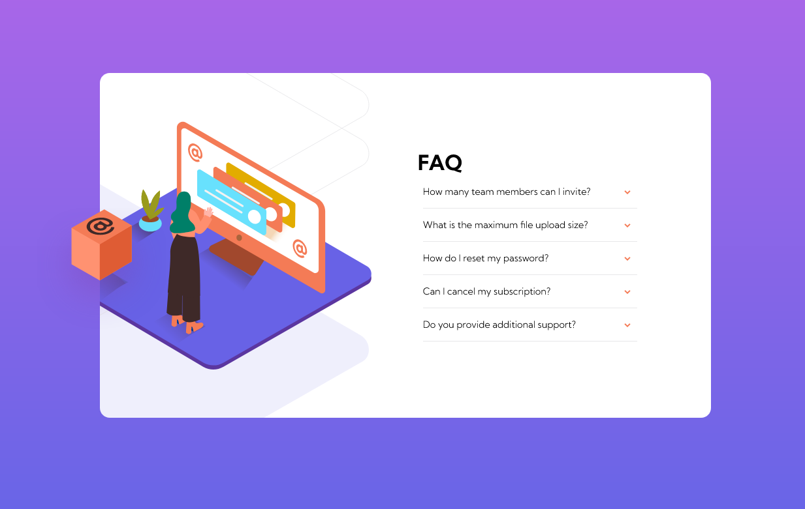

# Frontend Mentor - FAQ accordion card

.png>)

.png>)

## Welcome! 👋

### Links

- Solution URL: [solution URL](https://stunning-seahorse-913e61.netlify.app/)

### Built with

- Semantic HTML5 markup
- CSS custom properties
- Flexbox
- Mobile-first workflow
- Vanilla Javascript
